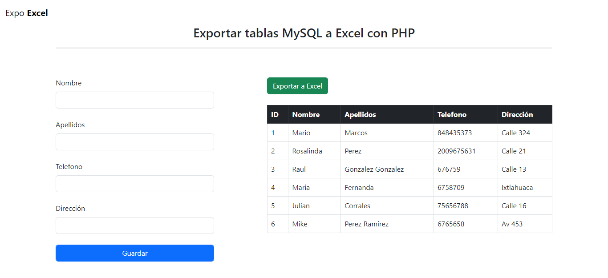
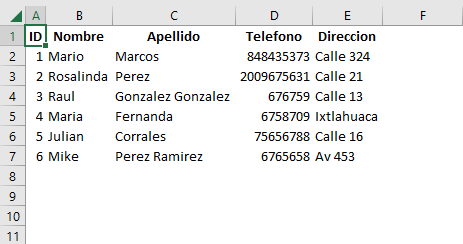

#   Exportar tablas MySQL a Excel con PHP


<p aling="center">
    
</p>


##  Formato en Excel:
<p aling="center">
    
</p>


##  Creación de la DB:
```sql
CREATE DATABASE exportar_excel_php;
```

### Creación de la tabla Clientes:

```sql
CREATE TABLE clients (
  id int(11) NOT NULL,
  name varchar(50) NOT NULL,
  lastname varchar(50) NOT NULL,
  tel int(10) NOT NULL,
  address varchar(100) NOT NULL
) ENGINE=InnoDB DEFAULT CHARSET=latin1;
```

####    Llave Primaria
```sql
ALTER TABLE clients
  ADD PRIMARY KEY (id);
```

####    Auto Incremento 
```sql
ALTER TABLE clients
  MODIFY id int(11) NOT NULL AUTO_INCREMENT, AUTO_INCREMENT=3;
COMMIT;
```